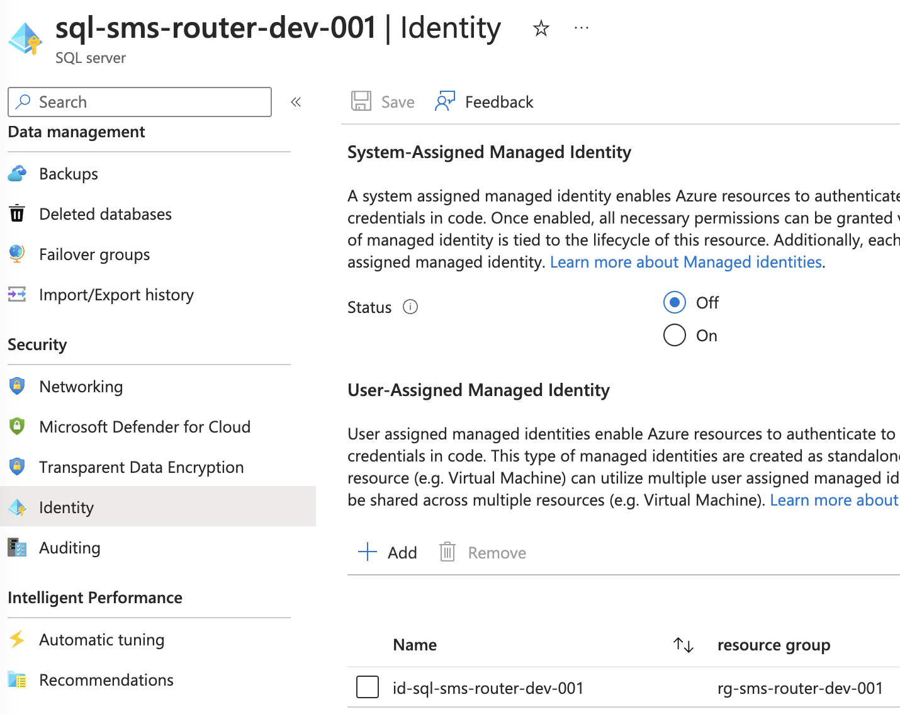
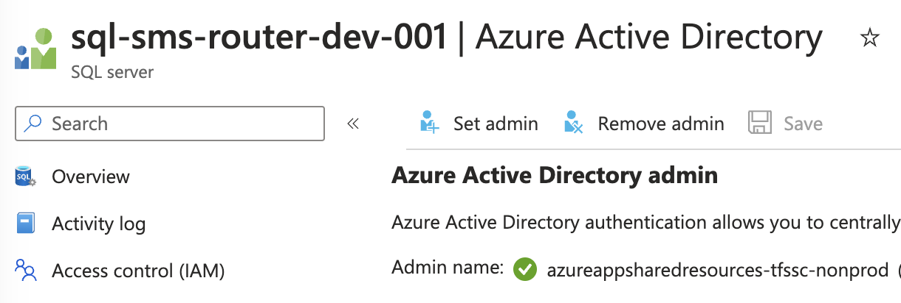

# Automating Creation of Az Sql Contained Users
I have an Azure Function app called sms-router that uses an Azure Sql Database. This means it needs permission onto the database. Creating contined users manually requires a simple t-sql statement such as:

```sql
CREATE USER [function-app-name] FROM EXTERNAL PROVIDER
ALTER ROLE db_datawriter ADD MEMBER [function-app-name]
ALTER ROLE db_datareader ADD MEMBER [function-app-name]
```

However, automating this was complicated!

## Steps Required

1. Request azure tenant admin create a group that has "Directory Reader" permission
2. Request service principal of the devops service connection be made "owner" of the new group
3. Assign service principal app id to devops pipeline variable - to be used later (yaml)
4. Create function app, assign sytem managed idenity (bicep)
5. Create user managed identity (UMI) (to be used for azure sql server) (bicep)
6. Create azure sql server, with UMI. Return UMI to pipeline (bicep)
7. Add user managed identity to the az ad group that has "Directory Reader" (PowerShell)
8. Create contained users

# Key Points
+ The Azure Sql Server must have its identity set to the newly created UMI, as shown below:

+ The UMI must be a member of the group with "Directory Reader permission.

+ The Azure Active Directory Admin of the Azure Sql Server must be set to the service principal of the devops service connection, as shown below:



###  Assign service principal app id to devops pipeline variable - to be used later
```yaml
- task: AzureCLI@2
        name: AssignServicePrincipalObjectId
        inputs:
          azureSubscription: ${{ variables.azSubscription }}
          scriptType: 'bash'
          scriptLocation: 'inlineScript'
          inlineScript: |
            echo "pipelineSvcPrincipal: $(pipelineSvcPrincipal)"
            az ad sp list --display-name $(pipelineSvcPrincipal) --output json > sp.json
            cat sp.json
            appId=$(cat sp.json | jq -r '.[0].appId')
            echo "Debug: Set local appId to $appId"  # Debugging the local variable
            echo "##vso[task.setvariable variable=svcPrincipalAppId;isOutput=true]$appId"
```
### Create azure sql server, with UMI. Return UMI to pipeline
```yaml
- task: AzureCLI@2
    displayName: Deploy Template and Get Managed Identity of Sql
    inputs:
        azureSubscription: ${{ variables.azSubscription }}
        scriptType: pscore
        scriptLocation: inlineScript
        inlineScript: |
        echo "Going to deploy bicep and assign managed identity of Azure SQL to pipeline variable"
        $deploymentName = "sms-router-$([datetime]::UtcNow.ToString("yyMMddhhmmssfff"))"
        $deploymentResult = az deployment group create `
            --name $deploymentName `
            --resource-group $(resourceGroup) `
            --template-file deploy/bicep/smsRouter.main.bicep `
            --parameters sqlAdLogin=$(pipelineSvcPrincipal) sqlAdObjectId=$(AssignServicePrincipalObjectId.svcPrincipalAppId) sqlAdminUsername=$(sqlAdminUsername) sqlPass=$(sqlPass) environment=dev
        $deploymentOutput = $deploymentResult | ConvertFrom-Json
        $managedIdentityResourceId = $deploymentOutput.properties.outputs.userDefinedManagedIdentityId.value
        if ([string]::IsNullOrEmpty($managedIdentityResourceId)) {
            throw "Managed Identity Resource ID is null or empty. Exiting pipeline."
        }
        echo "##vso[task.setvariable variable=managedIdentityResourceId]$managedIdentityResourceId"
```

```json
Bicep...

resource userDefinedManagedIdentity 'Microsoft.ManagedIdentity/userAssignedIdentities@2018-11-30' = {
  name: 'id-${sqlServerName}'
  location: location
}

resource sqlServer 'Microsoft.Sql/servers@2022-05-01-preview' = {
  name: sqlServerName
  location: location
  identity: {
    type: 'UserAssigned'
    userAssignedIdentities: {
      '${userDefinedManagedIdentity.id}': {}
    }
  }
  properties: {
    administratorLogin: sqlAdminUsername
    administratorLoginPassword: sqlAdminPwd
    primaryUserAssignedIdentityId: userDefinedManagedIdentity.id
  }
}
```

### Add user managed identity to the az ad group that has "Directory Reader" (PowerShell)
Note: Possible this could be simplified. Perhaps the bicep could return the app id of the user managed identity then there would be no need for the Get-AzUserAssignedIdentity step in the following:
```yaml
      - task: AzurePowerShell@5
        displayName: Add Managed Identity of SqlDb to Azure AD Group
        inputs:
          azureSubscription: azureappsharedresources-tfssc-nonprod-dev-001
          ScriptType: InlineScript
          azurePowerShellVersion: LatestVersion
          pwsh: true
          Inline: |
            $managedIdentityResourceId = "/subscriptions/$(subscriptionId)/resourceGroups/rg-sms-router-$(env)-001/providers/Microsoft.ManagedIdentity/userAssignedIdentities/id-sql-sms-router-$(env)-001"
            Write-Host "Managed Identity Resource ID: $managedIdentityResourceId"

            # Fetch the Managed Identity GUID
            $managedIdentityId = (Get-AzUserAssignedIdentity -ResourceGroupName "rg-sms-router-$(env)-001" -Name "id-sql-sms-router-$(env)-001").PrincipalId
            Write-Host "Managed Identity ID (GUID): $managedIdentityId"

            $groupName = "GRP-AZ-Admin-AzureADRole-DirectoryReaders-Devops-AzureSqlDB-ManagedIdentities"

            # Get the group object ID
            $group = Get-AzADGroup -DisplayName $groupName
            $groupObjectId = $group.Id
            Write-Host "Group Object ID: $groupObjectId"

            # Check if the managed identity is already a member
            $groupMembers = Get-AzADGroupMember -ObjectId $groupObjectId
            Write-Host "Debug: All Group Members: $($groupMembers | ConvertTo-Json)"  # Debug line

            $isMember = $groupMembers | Where-Object {$_.Id -eq $managedIdentityId}

            Write-Host "isMember: $isMember"
            if ($null -eq $isMember) {
              # Add the managed identity to the group
              Add-AzADGroupMember -TargetGroupObjectId $groupObjectId -MemberObjectId $managedIdentityId
              if ($LASTEXITCODE -ne 0) {
                Write-Host "Failed to add Managed Identity to the group. It might already be a member."
              } else {
                Write-Host "$managedIdentityId has now been added to the group $groupName."
              }
            } else {
              Write-Host "Managed Identity is already a member of the group."
            }
```
### Create contained users
```powershell
#Permissions for function app.
New-User -dbServerName $dbServerName -dbName $dbName -username $functionAppName -accessToken $accessToken -userType "user"
$sql = "ALTER ROLE db_datareader ADD MEMBER ""${functionAppName}"";`
ALTER ROLE db_datawriter ADD MEMBER ""${functionAppName}"";`
ALTER ROLE db_ddladmin ADD MEMBER ""${functionAppName}"";"
Write-Host "going to run sql:${sql}"
Invoke-Sqlcmd -ServerInstance $dbServerName -Database $dbName -AccessToken $accessToken -query $sql
Write-Host "Permissions for function app complete"
}

function New-User {
    param (
        [Parameter(Mandatory)]
        $dbServerName,
        [Parameter(Mandatory)]
        $dbName,
        [Parameter(Mandatory)]
        $username,
        [Parameter(Mandatory)]
        $accessToken,
        [Parameter(Mandatory)]
        [ValidateSet('user','group')]
        $userType
    )
    Write-Host "*** Starting function New-User ***"
    Write-Host "dbServerName=${dbServerName}"; Write-Host "dbName=${dbName}"; Write-Host "username=${username}"; Write-Host "accessToken=$($accessToken.Substring(0, 4))"; Write-Host "userType=${userType}"
    
    $typeSymbol = $userType -eq 'User' ? "E" : "X"
    
    $sql = "IF EXISTS (SELECT [name]`
            FROM [sys].[database_principals]`
            WHERE [type] = '${typeSymbol}' AND [name] = '${username}')`
                DROP USER ""${username}""`
            ELSE`
                SELECT 'User did not exist previously'"

    Invoke-Sqlcmd -ServerInstance $dbServerName -Database $dbName -AccessToken $accessToken -query $sql
    
    $sql = "CREATE USER ""${username}"" FROM EXTERNAL PROVIDER;"

    Write-Host "Going to run sql:$sql" 
    Invoke-Sqlcmd -ServerInstance $dbServerName -Database $dbName -AccessToken $accessToken -query $sql
    Write-Host "*** Leaving function New-User ***"
}
```

