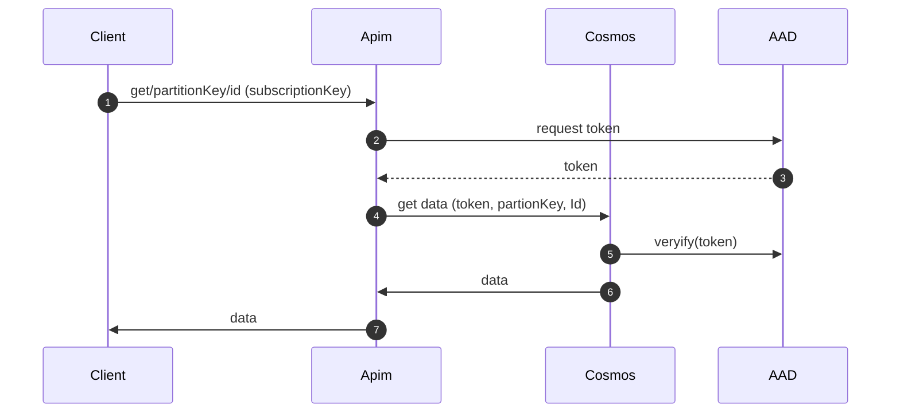

## Overview
For many integration solutions, it's often necessary to maintain a list of reference data. This could be a list of countries, currencies, or even a list of valid values for a particular field.

Since Cosmos DB provides a REST API for data access, I wondered if it would be possible to create a secure reference data service using just Azure API Management and Cosmos DB (API for NoSQL).

## Sample DB
I created the following Cosmos DB database and collection:

| id       | species | French  | German    |
|----------|---------|---------|-----------|
| Dog      | Mammal  | Chien   | Hund      |
| Cat      | Mammal  | Chat    | Katze     |
| Goldfish | Fish    | Poisson | Fisch     |
| Parrot   | Bird    | Oiseau  | Vogel     |
| Rabbit   | Mammal  | Lapin   | Kaninchen |
| Hamster  | Mammal  | Hamster | Hamster   |
| Geko     | Lizard  | Lézard  | Eidechse  |


In the sample database, the “species” property was defined as the partition.

## Solution
The following diagram illustrates the sequence of calls required:



1. Client makes a simple https get request to api management. It passes a subscription key in the header. The apim requested is available only from our vnet. The request includes two template parameters:
   + partitionKey e.g. Mammal
   + id e.g. Dog
2. The Apim policy obtain a token required to read from Cosmos using managed identity:
    ```html
    <authentication-managed-identity resource="https://cosmos-sandpit-dev-01.documents.azure.com" output-token-variable-name="msi-access-token" ignore-error="false" />
    ```
3. AAD returns the token
4. Apim uses the rest api of Cosmos to request the data
5. Cosmos verifies the token provided by apim
6. Cosmos returns the data to Apim
7. Apim returns the data to the Client eg:

```json
{
    "id": "Dog",
	"species": "Mammal,
    "French": "Chien",
    "German": "Hund"
}
```

### Role Assignment for APIM onto Cosmos
Cosmos DB has two built-in role definitions as described [here](https://learn.microsoft.com/en-us/azure/cosmos-db/how-to-setup-rbac#built-in-role-definitions):

1. Cosmos DB Built-in Data Reader
2. Cosmos DB Built-in Data Contributor

The Data Reader role can be assigned to the managed identity of the Apim instance as follows:

```bash
az cosmosdb sql role assignment create --account-name cosmos-sandpit-dev-01 --resource-group rg-sandpit --scope "/" --principal-id principalOfTheManagedIdofAPIM --role-definition-id /subscriptions/xxxxx/resourceGroups/comsos-db-rg/providers/Microsoft.DocumentDB/databaseAccounts/comos-db-no-sql/sqlRoleDefinitions/00000000-0000-0000-0000-000000000001
```
Note: at time of writing, it's not possible to assign this built-in-role using the Azure Portal.

### APIM Configuration
#### URL Template
The APIM operation is defined with the following URL template: 

+ /{partition}/{id}

The values provided in the URL segments when the client calls the API are then automatically assigned to the “MatchedParameters” collection of the APIM context request object.

Examples:
+ https://internal-apim.azure-api.net/pets/Mammal/Dog
+ https://internal-apim.azure-api.net/pets/Mammal/Cat
+ https://internal-apim.azure-api.net/pets/Bird/Parrot

#### APIM Policy
Most of the configuration to enable this solution is made in the apim policy
```xml
<inbound>
      <base />
      <set-backend-service base-url="https://cosmos-sandpit-dev-01.documents.azure.com:443/" />
      <set-variable name="requestDateString" value="@(DateTime.UtcNow.ToString("r"))" />
      <authentication-managed-identity resource="https://cosmos-sandpit-dev-01.documents.azure.com" output-token-variable-name="msi-access-token" ignore-error="false" />
      <set-header name="Authorization" exists-action="override">
          <value>@("type=aad&ver=1.0&sig=" + context.Variables["msi-access-token"])</value>
      </set-header>
      <set-header name="x-ms-date" exists-action="override">
          <value>@(context.Variables.GetValueOrDefault<string>("requestDateString"))</value>
      </set-header>
      <set-header name="x-ms-version" exists-action="override">
          <value>2018-12-31</value>
      </set-header>
      <set-header name="x-ms-documentdb-query-enablecrosspartition" exists-action="override">
          <value>false</value>
      </set-header>
      <set-header name="x-ms-documentdb-partitionkey" exists-action="override">
          <value>@{ return "[\"" + context.Request.MatchedParameters["partition"]+ "\"]";}</value>
      </set-header>
      <rewrite-uri template="/dbs/Animals/colls/small-pets/docs/{id}" copy-unmatched-params="true" />
  </inbound>
```
The key statements within this policy are described below:

+ authentication-managed-identity. Uses the managed identity of the APIM instance to obtain an access token for the target Cosmos DB from AAD (Entra). 
+ set-header name="Authorization". The token acquired in the previous step is given as the value for the “Authorization” request header.
+ set-header name="x-ms-documentdb-partitionkey". The partition key is taken from the request URL used when the client called APIM. This is then passed on to Cosmos DB in the custom request header.

#### Caching
A reference data database is a good candidate for caching because the data changes infrequently. Azure API Management provides a simple method to employ caching through use of the following policies:

+ cache-lookup on the inbound section
+ cache-store on the outbound section

This is shown in the following example:

```xml
<policies>
    <inbound>
        <base />
        <cache-lookup vary-by-developer="false" vary-by-developer-groups="false" downstream-caching-type="none" must-revalidate="true" caching-type="internal" >
            <vary-by-query-parameter>version</vary-by-query-parameter>
        </cache-lookup>
    </inbound>
    <outbound>
        <cache-store duration="seconds" />
        <base />
    </outbound>
</policies>
```
Note: Cache policies are only effective on APIM SKUs **above** “Consumption”

# Loading the Data into Cosmos DB
We need a script that can be run from a DevOps pipeline to load the static data from JSON files into the database.

## Sample Data
The data file must be made available to the PowerShell script

```json
[
    {
        "id": "Goose",
        "French": "Oie",
        "German": "Gans",
        "species": "Bird"
    },
    {
        "id": "Badger",
        "French": "blaireau",
        "German": "Dachs",
        "species": "Mammal"
    }
]
```

## PowerShell Script:
```powershell
# Connect-AzAccount
# $subscription = Get-AzSubscription -SubscriptionName "Azure Free Trial"
# Set-AzContext -Subscription $subscription

$data = Get-Content '.\sample-data-3.json' | ConvertFrom-Json

$accountName = "cosmos-sandpit-dev-01"
$databaseName = "ReferenceData"
$containerName = "Container2"
$resourceGroupName = "rg-sandpit"

# Import CosmosDB module
$moduleName = "CosmosDB"
Import-Module $moduleName -ErrorAction Stop

$cosmosDbContext = New-CosmosDbContext -Account $accountName -Database $databaseName -ResourceGroup $resourceGroupName

foreach ($item in $data) {
    # Ensure that each item has a unique 'id'
    $item | Add-Member -Type NoteProperty -Name 'id' -Value ($item.domain + '-' + $item.concept)

    # Make sure the Domain field is present
    $domain = $item.domain
    if ($null -eq $domain) {
        Write-Host "Domain field is missing in the item with id: $($item.id)"
        continue
    }

    # Since we are using 'Domain' as the partition key, ensure it is present at the root level of the document
    $document = $item | ConvertTo-Json

    try {
        # Insert the document into the container
        New-CosmosDbDocument -Context $cosmosDbContext -CollectionId $containerName -DocumentBody $document -PartitionKey $domain
    } catch {
        Write-Host "Error inserting document with id $($item.id): $_"
    }
}
```

# Addendum
The example policy given above works well when a single value is required to idetify the required database entity.

It is also possible to create an APIM policy that makes use to Cosmos' Powerfull Sql Query capability by composing a Sql expression to be POSTED to cosmos in the message body.

```xml
<!-- Compose Cosmos DB query -->
<set-variable name="domain" value="@{ return context.Request.MatchedParameters["domain"]; }" />
<set-variable name="cosmosQuery" value="@{
    string domain = context.Variables.GetValueOrDefault<string>("domain");
    string concept = context.Request.MatchedParameters["concept"];
    return "{ \"query\": \"SELECT * FROM c WHERE c.domain = '" + domain + "' AND c.concept = '" + concept + "'\" }";
}" />
<!-- Set the composed query as the message body -->
<set-body>@(context.Variables.GetValueOrDefault<string>("cosmosQuery"))</set-body>
<!-- Set the partition key header -->
<set-header name="x-ms-documentdb-partitionkey" exists-action="override">
    <value>@{ return "[\"" + context.Variables.GetValueOrDefault<string>("domain") + "\"]"; }</value>
</set-header>
<set-method>POST</set-method>
<set-header name="Content-Type" exists-action="override">
    <value>application/query+json</value>
</set-header>
<cache-lookup vary-by-developer="false" vary-by-developer-groups="false" downstream-caching-type="none" must-revalidate="true" caching-type="internal" >
    <vary-by-query-parameter>version</vary-by-query-parameter>
</cache-lookup>
```

For the above policy, a client would request data with a url such as:

https://my-apim/ref-data/domains/CRM/concepts/CurrencyTypes 

Note: the url template for the api would be:

/ref-data-3/domains/{domain}/concepts/{concept}