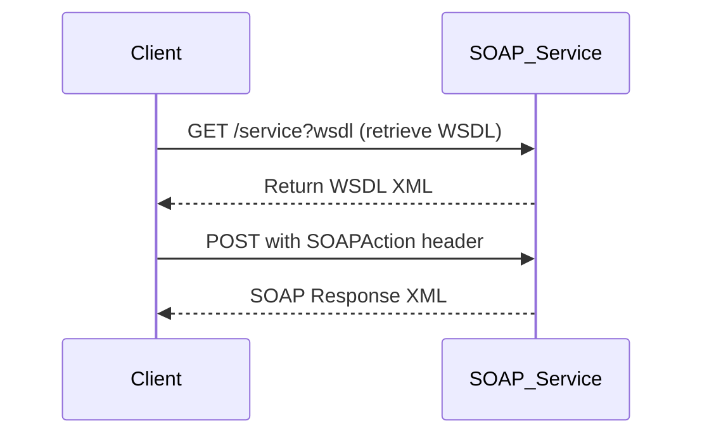

# Testing SOAP Web Services Using REST Test Tools

SOAP web services, though traditionally viewed as complex and specialized, can actually be effectively tested using common REST testing tools like `curl` or the **REST Client** extension in Visual Studio Code. While SOAP services differ significantly from RESTful APIs, understanding their basic principles simplifies the testing process greatly.

Let's explore the basics and see how simple tools can help you test SOAP endpoints.

## SOAP Basics You Need to Know

Two critical points when interacting with SOAP services are:

- **WSDL Access:** The Web Services Description Language (WSDL) file defines the service and its operations. Retrieving the WSDL itself requires an HTTP GET request.

- **Operation Execution:** Apart from fetching the WSDL, SOAP service operations typically use POST requests exclusively. Each POST request should contain a specific `SOAPAction` header, indicating the SOAP operation to execute.

## Testing SOAP with curl

Here's how you can perform a SOAP request using `curl`:

```bash
curl -X POST \
     -H "Content-Type: text/xml;charset=UTF-8" \
     -H "SOAPAction: \"YourSOAPActionHere\"" \
     --data '<?xml version="1.0" encoding="UTF-8"?>
     <soapenv:Envelope xmlns:soapenv="http://schemas.xmlsoap.org/soap/envelope/">
         <soapenv:Header/>
         <soapenv:Body>
             <!-- Your SOAP request body here -->
         </soapenv:Body>
     </soapenv:Envelope>' \
     https://your-soap-service-url.com/endpoint
```

Replace `YourSOAPActionHere` with the specific SOAP action, and ensure the body contains the required XML for the operation you wish to test.

## Using REST Client Extension in VS Code

Visual Studio Code’s REST Client extension makes this even easier. Here's a quick example:

```http
POST https://your-soap-service-url.com/endpoint HTTP/1.1
Content-Type: text/xml;charset=UTF-8
SOAPAction: "YourSOAPActionHere"

<?xml version="1.0" encoding="UTF-8"?>
<soapenv:Envelope xmlns:soapenv="http://schemas.xmlsoap.org/soap/envelope/">
    <soapenv:Header/>
    <soapenv:Body>
        <!-- Your SOAP request body here -->
    </soapenv:Body>
</soapenv:Envelope>
```

You can directly execute this request from within VS Code, and the response will be neatly displayed in the editor.

## Understanding the SOAPAction Header

The `SOAPAction` HTTP header is crucial for identifying the SOAP operation to execute. Omitting or incorrectly specifying this header often leads to errors or unexpected behaviors. The exact value of this header can usually be found in the WSDL document under the `soapAction` attribute of the specific operation.

Example:

```xml
<wsdl:operation name="GetCustomerInfo">
    <soap:operation soapAction="http://example.com/GetCustomerInfo"/>
</wsdl:operation>
```

Thus, the correct SOAPAction header would be:

```
SOAPAction: "http://example.com/GetCustomerInfo"
```

## Mermaid Sequence Diagram

Here's a Mermaid sequence diagram illustrating the process clearly:



## Conclusion

Testing SOAP services using simple tools such as `curl` or the REST Client VS Code extension is straightforward once you understand the requirement for POST operations and the necessity of the `SOAPAction` header. These methods provide quick, effective ways to validate SOAP services without specialized software.
