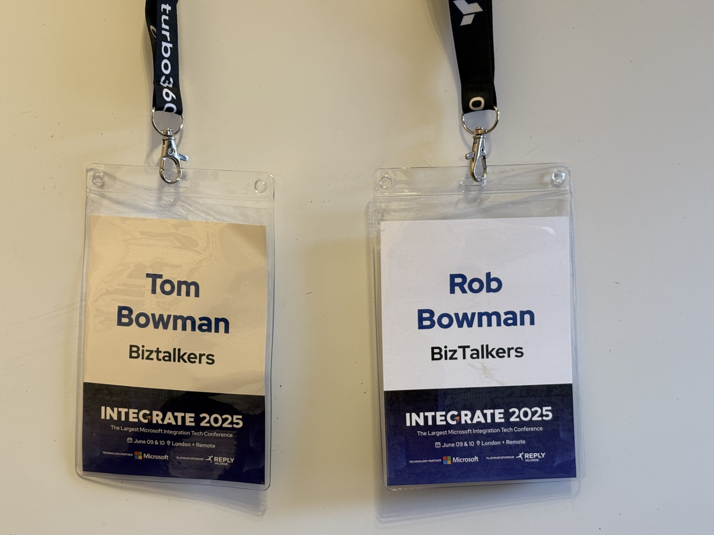
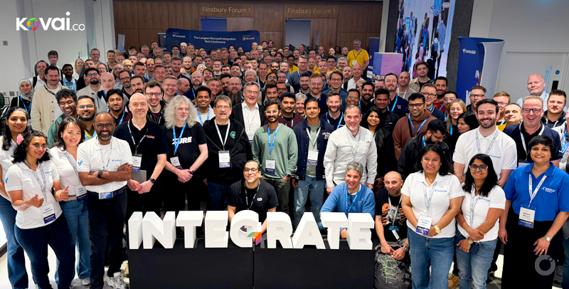

# Another Excellent Integrate Conference

June 9th and 10th and another trip to London for the Integrate conference. This year I was accompanied by my son Tom who has recently joined with BizTalkers on a degree apprenticeship. 

The two days were packed full of sessions, with a mixture of demos of the latest Azure Integration Services features and lessons from the field. 

Undoubtedly, the feature receiving the most attention was the [Logic Apps Agent Loop](https://techcommunity.microsoft.com/blog/integrationsonazureblog/%F0%9F%93%A2announcing-agent-loop-build-ai-agents-in-azure-logic-apps-%F0%9F%A4%96/4415052). This was covered by multiple speakers but the standout sessions was by MVP Stephen Thomas who gave a fun but impactful demo of how this can be used to create an agent to play card games.

Stephen has provided details guidance of how to replicate this demo on his [blog](https://www.stephenwthomas.com/azure-integration-thoughts/step-by-step-guide-to-azure-logic-apps-agent-loop/). After returning from the conference I sat down with Tom to see if we could recreate the demo. It was quite straightforward but impactful. The magic is in the "Agent Parameters" that are passed between the main Agent Loop action and it's "Agent Tools".  

Another highlight for me was the session by [Toon Vanhoutte](https://yourazurecoach.com/2025/06/10/looking-back-at-integrate-2025/). I always enjoy Toon’s sessions and this one was no exception. He shared his real-world experience, using Azure to develop a solution to improve custom support for a company that supplier pallet boilers. 

I'd also like to thank our friends and conference sponsor [Affinus](https://www.affinus.com/) for making Tom so welcome on his first conference. 

