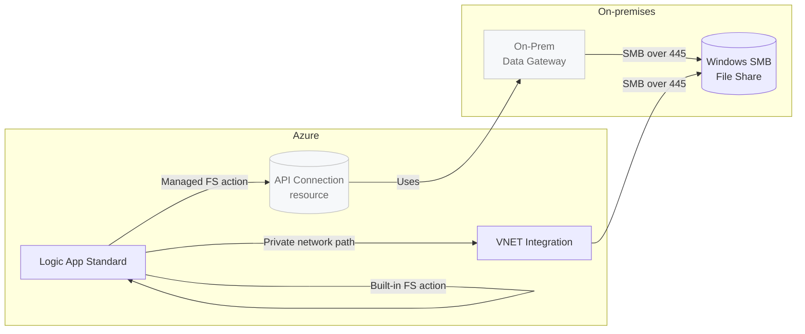

# Goodbye (good riddance) to the On‑Prem Data Gateway (OPDG)

Logic App Standard workflows can use either managed or built‑in connectors. Historically, if you needed to access an on‑prem Windows file share, you had to use the File System managed connector with the OPDG — unless you were running in ASEv3. That guidance is now out of date: the built‑in File System connector works on Logic App Standard when the app is VNET‑integrated, without OPDG.

Why this matters:
- Simpler setup — no API connection resource with opaque parameters and no gateway footprint on‑prem.
- Lower complexity in ops — source/target locations are declared directly on the built‑in connection, easy to inspect.
- Cost clarity — built‑in actions run on your App Service Plan. Managed connectors are metered per action call and add an API connection resource.

## Managed vs built‑in: how they differ

Key differences:
- Managed connector
  - Requires an API connection resource and (for on‑prem) the OPDG.
  - Per‑action billing applies; config lives outside the workflow.
- Built‑in connector
  - No API connection resource, no OPDG. Uses the app’s network path (VNET integration/ASEv3) to reach the SMB share.
  - Configuration (root folder, credentials) is part of the built‑in connection in the workflow.

## How the built‑in File System connector actually works

The built‑in connector does not sync via an Azure Storage account or Azure Files as an intermediary. It connects directly to the target SMB share over the network path available to the Logic App Standard runtime. In practice that means:
- Your app must be Windows‑based, VNET‑integrated, and have line‑of‑sight to the file server’s FQDN/IP on TCP 445.
- DNS must resolve the FQDN you provide in the connection’s root path.
- You authenticate with domain\username and password that has share and NTFS permissions.

From the Microsoft reference for the built‑in File System connector:
- Expects FQDN in the root folder path; supports Windows file systems; mapped network drives aren’t supported; and the built‑in connector has a limit of up to 20 connections per Logic App resource. See “File System built‑in connector” docs.

> Note: App‑level storage mounts (such as App Service “Azure Storage” mounts under `azureStorageAccounts`) are not required for the built‑in File System connector. Some teams still use mounts for other scenarios, but the built‑in connector itself can authenticate and access the UNC path directly when the network path is reachable.

## Prerequisites and network checklist

- Logic App Standard (Windows) on an App Service Plan
- Private VNET integration into a subnet that can reach the file server
- DNS resolution for the file server’s FQDN
- Firewall/routes permit SMB (TCP 445) end‑to‑end
- Service account with correct share and NTFS permissions
- Recommended app settings:
  - WEBSITE_CONTENTOVERVNET=1 (when content or mounts are accessed over VNET)
  - Always On = true
  - FUNCTIONS_EXTENSION_VERSION = ~4
  - Workflows extension bundle configured

## Creating the built‑in File System connection in a workflow

Provide these values when creating the connection (Built‑in > File System):
- Root folder: \\fileserver.domain.local\ShareName
- Username: domain\svc_logicapp
- Password: your secret
- Mount path: optional (a logical path under the sandbox used by the connector; not a mapped drive)

Once connected, use triggers/actions such as “When files are added or modified”, “Get file content (V2)”, and “Create file”.

Limitations and tips (from the docs):
- Windows file systems only; mapped network drives aren’t supported
- Up to 20 connections per Logic App resource; no duplicate root paths with different credentials
- Prefer FQDN over short names

## Deployment notes (what we changed in this repo)

We deploy the Logic App Standard with Bicep and then zip‑deploy the workflows. A recent pipeline failure showed `ResourceNotFound` for the site at the moment we pushed a site config block. The fix was to add an explicit dependency so the site config waits for the app to exist before creation. In other words: create the app first, then apply any site config (mounts), then deploy workflows.

## Why we prefer the built‑in connector

- Transparency: Source/destination paths and credentials are right in the connection you see in the workflow designer.
- Simpler ops: No separate API connection resource; no OPDG to install/maintain.
- Predictable cost: Runs on your App Service Plan compute rather than per‑action managed connector billing.

## References

- Built‑in File System connector reference (Standard): https://learn.microsoft.com/azure/logic-apps/connectors/built-in/reference/filesystem/
- “Connect to on‑premises file systems from workflows” overview: https://learn.microsoft.com/azure/connectors/file-system
- Community updates confirming support on Logic App Standard with VNET (no ASEv3 required):
  - Using File System connector in Logic Apps Standard (original guidance mentioning ASEv3): https://techcommunity.microsoft.com/blog/integrationsonazureblog/using-file-system-connector-in-logic-apps-standard/3711426
  - File Systems connector support on Workflow Standard plans (update): https://techcommunity.microsoft.com/blog/integrationsonazureblog/file-systems-connector-support-on-workflow-standard-plans/4093382

